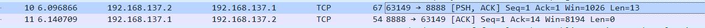
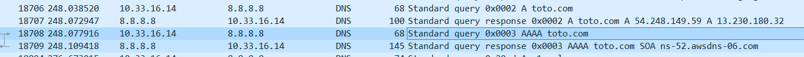

# I. Exploration locale en solo

## 1. Affichage d'informations sur la pile TCP/IP locale

### En ligne de commande

En utilisant la ligne de commande (CLI) de votre OS :

**🌞 Affichez les infos des cartes réseau de votre PC**
````
Carte réseau sans fil Wi-Fi :
   Adresse physique . . . . . . . . . . . : 60-E3-2B-90-26-E4
   Adresse IPv4. . . . . . . . . . . . . .: 10.33.16.14
````
J'ai pas de carte Ethernet :(

**🌞 Affichez votre gateway**
````
Carte réseau sans fil Wi-Fi :
   Passerelle par défaut. . . . . . . . . : 10.33.19.254
```` 
**🌞 Déterminer la MAC de la passerelle**

````
C:\Users\qcass>arp -a
Interface : 10.33.16.14 --- 0xa
  Adresse Internet      Adresse physique      Type
  10.33.19.254          00-c0-e7-e0-04-4e     dynamique
````
### En graphique (GUI : Graphical User Interface)

En utilisant l'interface graphique de votre OS :  

**🌞 Trouvez comment afficher les informations sur une carte IP (change selon l'OS)**
````
Adresse physique: 60-E3-2B-90-26-E4
Adresse IPv4: 10.33.16.14
Passerelle par défaut IPv4: 10.33.19.254
````

## 2. Modifications des informations

### A. Modification d'adresse IP (part 1)  

🌞 Utilisez l'interface graphique de votre OS pour **changer d'adresse IP** :

Panneau de configuration\Réseau et Internet\Centre Réseau et partage WIFI@YNOV
10.33.16.210

🌞 
On peut perdre l'accès à Internet parce que si on change d'adresse IP, le serveur ne reconnaît pas notre nouvelle adresse IP.


# II. Exploration locale en duo
## 3. Modification d'adresse IP

🌞 **Modifiez l'IP des deux machines pour qu'elles soient dans le même réseau**
````
10.10.10.1
255.255.255.0
````
🌞 **Vérifier à l'aide d'une commande que votre IP a bien été changée**
````
ipconfig /all
 Adresse IPv4. . . . . . . . . . . . . .: 10.10.10.1
````
🌞 **Vérifier que les deux machines se joignent**
````
ping 10.10.10.2
````
🌞 **Déterminer l'adresse MAC de votre correspondant**
````
arp -a
10.10.10.2 b4-45-06-a4-5c-76 dynamique
````

## 4. Utilisation d'un des deux comme gateway
🌞**Tester l'accès internet**

````
C:\Users\qcass>ping 8.8.8.8
Envoi d’une requête 'Ping'  8.8.8.8 avec 32 octets de données :
Réponse de 8.8.8.8 : octets=32 temps=21 ms TTL=114
Réponse de 8.8.8.8 : octets=32 temps=20 ms TTL=114

Statistiques Ping pour 8.8.8.8:
    Paquets : envoyés = 2, reçus = 2, perdus = 0 (perte 0%),
Durée approximative des boucles en millisecondes :
    Minimum = 20ms, Maximum = 21ms, Moyenne = 20ms
````

🌞 **Prouver que la connexion Internet passe bien par l'autre PC**

````
Détermination de l’itinéraire vers one.one.one.one 
[1.1.1.1]  avec un maximum de 30 sauts : 
1 	   1 ms    1 ms    1 ms    SeigneurHugoPCMasterRace [192.168.137.1] 
2 			* 			* 			* Délai d’attente de la demande dépassé. 
3 6 ms 5 ms 3 ms 10.33.19.254 
4 5 ms 5 ms 4 ms 137.149.196.77.rev.sfr.net [77.196.149.137] 
5 17 ms 8 ms 8 ms 108.97.30.212.rev.sfr.net [212.30.97.108] 
6 21 ms 20 ms 21 ms 222.172.136.77.rev.sfr.net [77.136.172.222] 
7 22 ms 23 ms 23 ms 221.172.136.77.rev.sfr.net [77.136.172.221] 
8 25 ms 25 ms 25 ms 221.10.136.77.rev.sfr.net [77.136.10.221] 
9 26 ms 29 ms 24 ms 221.10.136.77.rev.sfr.net [77.136.10.221] 
10 49 ms 34 ms 30 ms 141.101.67.254 11 
40 ms 39 ms 88 ms 172.71.128.2 
12 25 ms 26 ms 23 ms one.one.one.one [1.1.1.1] 

Itinéraire déterminé.
````

## 5. Petit chat privé

🌞 **sur le PC *serveur***
````
C:\Users\hugoa\netcat-1.11> .\nc.exe -l -p 8888 
bonjour
bonjour 
ça va ou quoi 
c'est simple 
nice & easy 
ez
````


🌞 **sur le PC *client*** avec par exemple l'IP 192.168.1.2

````
C:\Users\Ethan\netcat-1.11> .\nc.exe 192.168.137.1 8888
bonjour
bonjour
ça va ou quoi
c'est simple
nice & easy
ez
````

🌞 **Visualiser la connexion en cours**
````
PS C:\Windows\system32> netstat -a -n -b
TCP    192.168.137.2:59814    192.168.137.1:8888     ESTABLISHED
[nc.exe]
Serveur :
C:\Windows\system32> netstat -a -n -b TCP 192.168.137.1:8888
192.168.137.2:59814 	ESTABLISHED 
[nc.exe]
````

🌞 **Pour aller un peu plus loin**
````
C:\Windows\system32> netstat -a -n -b | Select-String 8888 
TCP 	0.0.0.0:8888 	0.0.0.0:0 	LISTENING
````
````
C:\Users\hugoa\netcat-1.11> .\nc.exe -l -p 8888 -s 192.168.137.1
````

## 6. Firewall

🌞 **Activez et configurez votre firewall**
````
C:\Users\hugoa\netcat-1.11> .\nc.exe -l -p 8888 -s 192.168.137.1 
 zfgdfg gvyuhujcvesjhcghuezsbch_duygv xhydu
gdfg 
fgfg 
ddssqerf
````
# III. Manipulations d'autres outils/protocoles côté client

## 1. DHCP

🌞**Exploration du DHCP, depuis votre PC**
````
C:\Users\qcass>ipconfig /all

Serveur DHCP . . . . . . . . . . . . . : 10.33.19.254
Bail expirant. . . . . . . . . . . . . : mercredi 5 octobre 2022 13:56:18
````

## 2. DNS

🌞** Trouver l'adresse IP du serveur DNS que connaît votre ordinateur**
````
C:\Users\qcass>ipconfig /all

Serveurs DNS. . .  . . . . . . . . . . : 8.8.8.8
                                       8.8.4.4
                                       1.1.1.1
````

🌞 **Utiliser, en ligne de commande l'outil `nslookup` (Windows, MacOS) ou `dig` (GNU/Linux, MacOS) pour faire des requêtes DNS à la main**
````
C:\Users\qcass>nslookup google.com
Serveur :   dns.google
Address:  8.8.8.8

Réponse ne faisant pas autorité :
Nom :    google.com
Addresses:  2a00:1450:4007:813::200e
          216.58.213.142

C:\Users\qcass>nslookup ynov.com
Serveur :   dns.google
Address:  8.8.8.8

Réponse ne faisant pas autorité :
Nom :    ynov.com
Addresses:  2606:4700:20::681a:ae9
          2606:4700:20::681a:be9
          2606:4700:20::ac43:4ae2
          172.67.74.226
          104.26.10.233
          104.26.11.233
````

Ynov utilise comme serveur le serveur de google et s'attribue 3 adresses ipv4 pour répartir les charges. 
````
C:\Users\qcass>nslookup ynov.com
Serveur :   dns.google
Address:  8.8.8.8
````
````
C:\Users\qcass>nslookup 231.34.113.12
Serveur :   dns.google
Address:  8.8.8.8

*** dns.google ne parvient pas à trouver 231.34.113.12 : Non-existent domain
````
````
C:\Users\qcass>nslookup 78.34.2.17
Serveur :   dns.google
Address:  8.8.8.8

Nom :    cable-78-34-2-17.nc.de
Address:  78.34.2.17
````

Pour le premier on n'a pas trouver de nom de domaine qui a pour ipv4 231.34.113.12, 
mais pour le deuxième on a le nom de domaine "cable-78-34-2-17.nc.de" qui a un adresse ipv4 78.34.2.17. 

# IV. Wireshark

**Wireshark est un outil qui permet de visualiser toutes les trames qui sortent et entrent d'une carte réseau.**

On appelle ça un **sniffer**, ou **analyseur de trames.**


Il peut :

- enregistrer le trafic réseau, pour l'analyser plus tard
- afficher le trafic réseau en temps réel

**On peut TOUT voir.**

Un peu austère aux premiers abords, une manipulation très basique permet d'avoir une très bonne compréhension de ce qu'il se passe réellement.

➜ **[Téléchargez l'outil Wireshark](https://www.wireshark.org/).**

🌞 Utilisez le pour observer les trames qui circulent entre vos deux carte Ethernet. Mettez en évidence :

- un `ping` entre vous et votre passerelle
````
C:\Users\hugoa\netcat-1.11> .\nc.exe -l -p 8888 -s 192.168.137.1
gyro zepelli
````

  
````
PS C:\Users\qcass> nslookup toto.com
````


# Bonus : avant-goût TCP et UDP


On voit que quand on regarde une vidéo youtube on reçoit des paquets de l'adresse 91.68.245.140 vers la notre et pour cela on nous a donné le port 443.

# Bilan

**Vu pendant le TP :**

- visualisation de vos interfaces réseau (en GUI et en CLI)
- extraction des informations IP
  - adresse IP et masque
  - calcul autour de IP : adresse de réseau, etc.
- connaissances autour de/aperçu de :
  - un outil de diagnostic simple : `ping`
  - un outil de scan réseau : `nmap`
  - un outil qui permet d'établir des connexions "simples" (on y reviendra) : `netcat`
  - un outil pour faire des requêtes DNS : `nslookup` ou `dig`
  - un outil d'analyse de trafic : `wireshark`
- manipulation simple de vos firewalls

**Conclusion :**

- Pour permettre à un ordinateur d'être connecté en réseau, il lui faut **une liaison physique** (par câble ou par *WiFi*).  
- Pour réceptionner ce lien physique, l'ordinateur a besoin d'**une carte réseau**. La carte réseau porte une adresse MAC  
- **Pour être membre d'un réseau particulier, une carte réseau peut porter une adresse IP.**
Si deux ordinateurs reliés physiquement possèdent une adresse IP dans le même réseau, alors ils peuvent communiquer.  
- **Un ordintateur qui possède plusieurs cartes réseau** peut réceptionner du trafic sur l'une d'entre elles, et le balancer sur l'autre, servant ainsi de "pivot". Cet ordinateur **est appelé routeur**.
- Il existe dans la plupart des réseaux, certains équipements ayant un rôle particulier :
  - un équipement appelé *passerelle*. C'est un routeur, et il nous permet de sortir du réseau actuel, pour en joindre un autre, comme Internet par exemple
  - un équipement qui agit comme **serveur DNS** : il nous permet de connaître les IP derrière des noms de domaine
  - un équipement qui agit comme **serveur DHCP** : il donne automatiquement des IP aux clients qui rejoigne le réseau
  - **chez vous, c'est votre Box qui fait les trois :)**